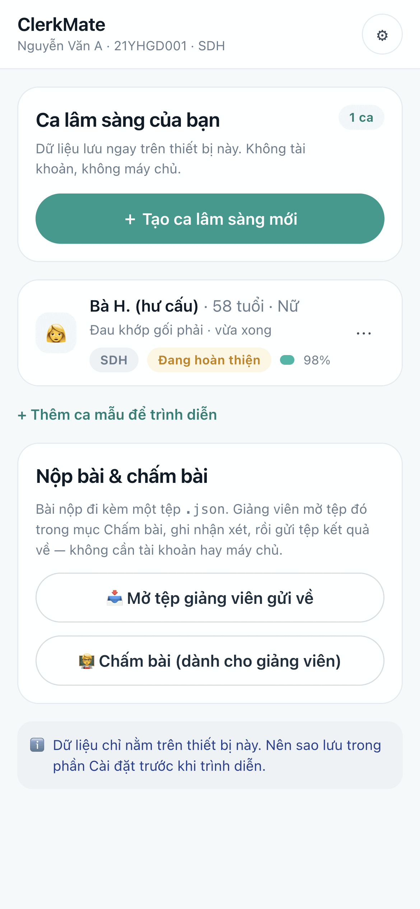
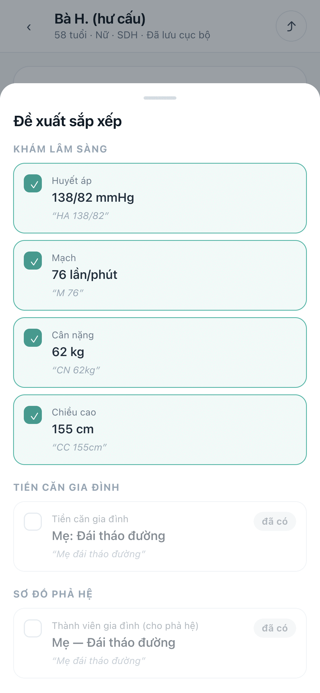
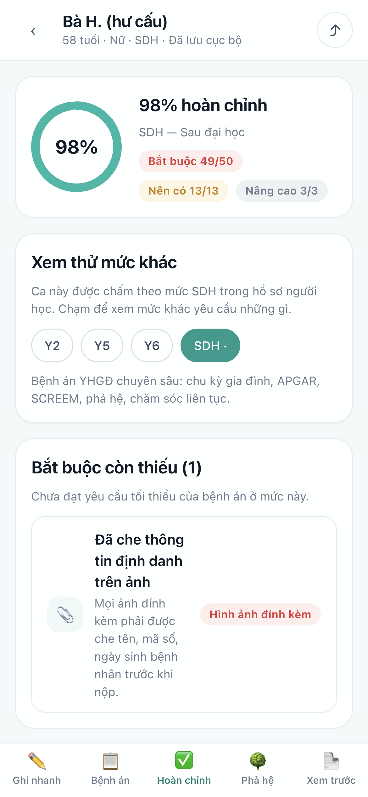
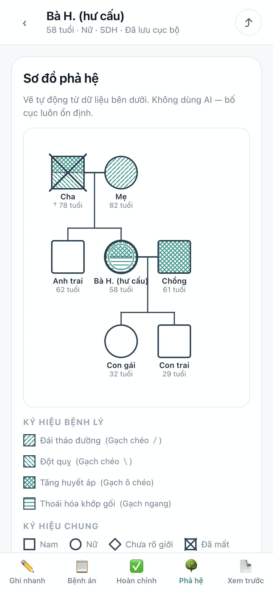

# ClerkMate

Mobile-first clinical learning record for Family Medicine training.

> **Educational tool, not a hospital EMR.** All demo data are simulated. The app does not diagnose
> and does not recommend treatment.

| | |
|---|---|
|  |  |
| Case list with level, processing state and completeness | Quick-note structuring — every suggestion quotes the note it came from |
|  |  |
| Completeness measured against the learner's own level | Genogram drawn from the family data, with a condition legend |

## Why ClerkMate

Students take notes during clinic and complete the formal record afterwards, from memory and from a
notebook. Things get lost in that gap: the patient's own worry, a red flag that was asked about and
excluded, which of several problems was actually the reason for the visit. And a blank field on paper
is ambiguous — it can mean "asked, nothing there" or "never asked", and a teacher cannot tell which.

ClerkMate closes the gap by making the note *become* the record:

```
quick capture → structured record → completeness check by level → submission
```

## Core features

Only what is implemented and verified today.

- **Quick note.** Type freely during the consultation. A deterministic on-device parser proposes
  which record fields the text belongs in and **quotes the phrase it came from** for each one.
  Nothing is written until the learner ticks it.
- **Structured record.** 18 sections: history with SOCRATES, red flags in two independent lists
  (recorded present / asked and excluded), ICE, past and family history, lifestyle, Family Medicine
  assessment (family type, life cycle, Family APGAR, SCREEM), examination, investigations, risk
  review, diagnosis, management, medications, prevention, longitudinal follow-up, learner reflection.
- **Learner-level completeness.** 66 requirement checks resolved against four levels — Y2 (15
  checks, 6 mandatory), Y5 (38/19), Y6 (59/31), postgraduate (66/50). Missing items are listed and
  each one links to the section that fixes it. Requirements that do not apply to a patient leave the
  denominator instead of counting as failures.
- **Genogram.** Generated from the family members entered: three generations, standard symbols, a
  hatch pattern per condition with a legend so it survives black-and-white printing.
- **Risk review.** 9 domains, 57 factors, each with a line on why it is asked. The scaffolding fades
  by level — Y2 gets the checklist, Y5 writes from memory first, Y6 and postgraduate get no list at
  all — with two deliberate exceptions: emergency risks keep their checklist at every level, and the
  social domain is read from SCREEM rather than asked twice. Seven rating scales, graded falls
  assessment, and a cardiovascular block that records the learner's own chart reading rather than
  calculating one.
- **Investigations and image attachments.** Results with sample dates and a per-result
  interpretation; a photographed lab slip attached to the result row it belongs to.
- **Identifier redaction.** Draw, move and resize boxes over the identifying band of a photographed
  result. Applying writes the boxes into the stored image at full resolution and replaces it — the
  covered pixels are gone from the copy ClerkMate holds, not hidden under an overlay.
- **PDF export.** The on-screen preview *is* the printed document. Export goes through the browser's
  print pipeline, so Vietnamese diacritics and selectable text survive with no embedded font. Every
  page carries a watermark of the declared level and the learner's ID.
- **Submission and reviewer workflow.** Eight processing states, five derived from the record's own
  content. Submitting locks the record and mints a submission code; the exported file can be opened
  by a faculty member in the same app to add a comment and return the work, which unlocks it and
  shows the comment in-app. No server and no accounts — the record itself is what moves.
- **Local-first, PWA, offline.** Records live in IndexedDB on the device. Installable to the home
  screen, and fully usable after the first load with no network.

## Demo

**No password and no login.** The first screen asks for a name and a student ID; that is a label
printed on the exported record, not an account — nothing is verified and nothing is sent anywhere.
Type anything, for example *Ban Giám khảo / BGK01*.

Then press **“▶ Dùng thử ca mẫu”** and pick a case. Two simulated cases ship fully filled in, so
there is no need to type a record by hand.

Recommended path for a reviewer, about ten minutes:

Home → seed a demo case → **Ghi nhanh** (insert the sample note, press *Sắp xếp vào bệnh án*) →
**Bệnh án** → **Hoàn chỉnh** (then switch the preview between Y2 / Y5 / Y6 / SDH) → **Phả hệ** →
**Hình ảnh đính kèm** (try the redaction tool) → **Xem trước** → *Xuất PDF* → *Nộp bài* →
Home → *Chấm bài* → return the work with a comment.

The step-by-step version is in [docs/DEMO.md](docs/DEMO.md).

## Architecture

- **React 19 + TypeScript + Vite.** Two runtime dependencies: `react` and `react-dom`.
- **IndexedDB** for storage; one repository module is the only code that touches it.
- **PWA** with a hand-written service worker; works offline after the first load.
- **Local-first:** no mandatory login, and **the core app requires no backend**.
- **Hash routing**, so the build is a plain static bundle that runs from any path.

More detail: [docs/ARCHITECTURE.md](docs/ARCHITECTURE.md).

## AI status

**PARTIAL — NOT YET VERIFIED.**

The parser that ships and runs by default is a deterministic rule-and-dictionary matcher running on
the device. **It is not AI.**

An optional second backend can send the quick-note text to an AI service to propose the same kind of
structuring suggestions. Its code is complete and its validation tests pass — every suggestion must
quote a span that occurs in the note, and the 24 allowed target fields exclude diagnosis,
management, prescriptions, investigations, examination and risk entirely. It is off by default,
requires an explicit privacy confirmation before its first request, and falls back to the local
parser on any failure or when offline.

**No real model call has been verified, because no API key is configured.** It therefore must not be
described as working. AI mode also cannot run on GitHub Pages, which serves static files only: the
proxy that holds the key is a serverless function, so on Pages the feature reports itself as
unconfigured and stays hidden.

Separately: AI was used to *write* this application, in a vibe-coding workflow driven by a Family
Medicine physician. That is a fact about how the code was produced, not a runtime feature.

## Privacy

- The competition demo uses **simulated patient data**. Judges need no real patient data.
- Records stay **on the device**, in IndexedDB. There is no account and no automatic cloud sync.
- The record has **no field for a patient identifier**, and the attachment redaction tool exists so
  that photographed slips can have identifiers removed before a record is shared.
- **IndexedDB is not encrypted.** Anyone who can use the browser profile can read the records, and
  clearing site data deletes them — Settings has a backup-to-file function.
- **No claim of compliance with any data-protection regulation is made**, and no third party has
  reviewed the app's security.

## Run locally

```bash
npm install
npm run dev
```

## Build

```bash
npm run build
npm run preview
```

## Verification

The verification harnesses are in this repository so that the product claims can be reproduced
rather than taken on trust. They need only Node and a local Chrome — no test framework and no extra
dependency.

```bash
npm test              # 55 rule checks: completeness engine, learner levels,
                      # status machine, submission gate, AI response validator.
                      # No browser needed; runs in CI on every push.

npm run preview:pages &   # serves the build under a repository subpath,
                          # i.e. the GitHub Pages hosting shape
npm run verify:app        # 100 end-to-end browser checks: judge flow, demo data,
                          # parser, completeness, redaction (including pixel
                          # checks), backup round-trip, the submission lock across
                          # every editable route, grading, PWA and offline
npm run verify:print      # 27 print checks plus a real sample PDF
```

What each check asserts, and which claims are verified versus not, is recorded in
[FINAL_PRODUCT_IMPLEMENTATION_FACT_SHEET.md](FINAL_PRODUCT_IMPLEMENTATION_FACT_SHEET.md), including
a CLAIM / STATUS / EVIDENCE table.

## Live demo

**GitHub Pages (primary):** *to be populated after the first deployment* —
`https://<USERNAME>.github.io/<REPO>/`

**Netlify (backup):** <https://clerkmate-yhgd.netlify.app>

Both serve the same build from the same source. Netlify additionally sends HTTP security headers
including a Content-Security-Policy, and is the only host that can run the optional AI proxy.

## Licence

See [LICENSE](LICENSE). No licence has been granted yet — the source is published so that judges and
the teaching department can read and verify it. Replace that file with a real licence before relying
on the code elsewhere.
